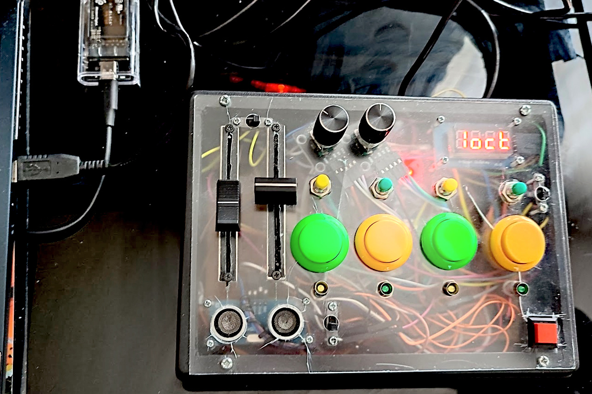

# MIDI P0AH PLAY (proto-serial)

DIY performance controller firmware (Arduino sketch) that outputs **MIDI over Serial**. It features a scale/chord engine, arp performance controls, CC control lanes, ultrasonic "D-Beam," pad lock/latch workflows, and MIDI clock sync.

### MIDI Signals Summary
* **Note On/Off:** Pads send note events (single notes or chord voicings depending on mode/scale settings).
* **Control Change (CC):** Encoders, faders, pad presets, and the ultrasonic sensor send CC values.
* **Clock/Transport Sync:** Listens to MIDI Clock, Start, Stop, Continue, and Song Position Pointer for tempo-synced arp behavior.



*This prototype build uses 4 Sanwa arcade push buttons.*

## 🕹 Operating Modes

Quick controls overview:

| Active mode | Fader 1 | Fader 2 | Encoder 1 (turn) | Encoder 2 (turn) | Left encoder push | Right encoder push | Encoder push + pad |
| :--- | :--- | :--- | :--- | :--- | :--- | :--- | :--- |
| `PLAY` (SW_PLAY) | Velocity | Octave | Scale select | Base note / transpose reference | MIDI channel (`CH1..CH16`) | Chord select | Left push + pad: lock pad + repeat settings; Right push + pad: unlock pad + repeat settings |
| `CC` (SW_CC) | CC lane 1 value | CC lane 2 value | CC lane 1 value | CC lane 2 value | CC lane 1 selection | CC lane 2 selection | Pad presets lane (C091-C100) |
| `REPEAT` (SW_REPEAT) | Velocity | Octave | Arp type select | Arp speed/divisor edit (`1:2..1:64`) | Arp step number edit (`St2..St16`); hold + Encoder 2 = precise speed/divisor edit | BPM edit (`###b`) | Left push + pad: latch/engage pad arp; Right push + pad: unlatch/stop pad arp |
| `ULTRASONIC` (SW_ULTRASONIC) | CC lane 1 value | CC lane 2 value | Ultrasonic target CC select | Ultrasonic max distance edit | no dedicated push-turn assignment | no dedicated push-turn assignment | no dedicated push + pad assignment |

Mode selection behavior:

* `SW_CC`, `SW_REPEAT`, `SW_ULTRASONIC`, and `SW_PLAY` are rising-edge selectors.
* `SW_CC` ON edge selects `CC` mode.
* `SW_REPEAT` ON edge selects `REPEAT` mode.
* `SW_ULTRASONIC` ON edge selects `ULTRASONIC` mode.
* `SW_PLAY` ON edge selects `PLAY` mode.
* For mode selection, latest ON edge wins.

Right after activation, display shows one of:  `PLAY`, `CC`, `REPEAT`, `ULTRASONIC`.

Mode transition display behavior:

* On mode change, firmware arms a delayed non-blocking mode-label scroll (no immediate static mode print).
* Mode-label scrolling is non-blocking and loop-driven: after 1500 ms idle it advances one frame every 120 ms while the main loop keeps running.
* Scroll uses full mode labels and legacy-style framing (starts blank and ends blank).
* If active interaction or any other display update occurs, pending/active mode scroll is canceled so control updates stay responsive.

Per-mode behavior:

* **PLAY Mode:**
  * Fader 1 = Velocity, Fader 2 = Octave.
  * With **no encoder push held**, Encoder 1 turn = scale select, Encoder 2 turn = base note / transpose reference.
  * Base-note selection follows the currently selected scale (stepwise scale degrees instead of fixed chromatic semitones; DRUM keeps direct semitone stepping).
  * Left encoder push: MIDI channel (`CH1..CH16`).
  * Right encoder push: chord select.
  * Chord and scale selectors wrap around.
  * Pad settings lock/unlock workflows (`pushSettingsLocked` + repeat settings lock):
    * Left push + pad press, or hold pad then left push -> lock pad settings and snapshot per-pad repeat settings.
    * Right push + pad press, or hold pad then right push -> unlock pad settings and repeat settings (resets both to global).
  * Lock/unlock feedback labels: `LOC Pn SET` / `ULOC Pn SET`.

* **CC Mode (`SW_CC` switch)**
  * Faders edit CC values for lanes 1 and 2.
  * With **no encoder push held**, encoder 1 and encoder 2 edit the CC values for lanes 1 and 2.
  * Hold **Left encoder push** (`P1SW`) for lane 1 CC selection/pad presets.
  * Hold **Right encoder push** (`P2SW`) for lane 2 CC selection/pad presets.
  * Preset CC labels are displayed as `C091..C100`.

* **REP Mode (`SW_REPEAT` switch)**
  * Fader 1 = Velocity, Fader 2 = Octave.
  * With **no encoder push held**, encoder 1 selects arp type and encoder 2 edits arp rate/divisor through fixed values: `1:2`, `1:4`, `1:8`, `1:16`, `1:32`, `1:64`.
  * Left encoder push: encoder 1 edits arp step number (`St2..St16`), and encoder 2 edits arp rate/divisor precisely one divisor step at a time.
  * Right encoder push: BPM edit.
  * Repeat lock workflows (`repeatIsLocked`):
    * Left push + pad press, or hold pad then left push -> latch/engage pad arp playback.
    * Right push + pad press, or hold pad then right push -> unlatch/stop pad arp playback.
    * Repeat lock controls arp latch behavior only; per-pad repeat settings are enabled by Play-mode pad lock.
  * Lock/unlock feedback labels: `LOC Pn REP` / `ULOC Pn REP`.
  * Arp selector wraps around.
  * Pad arp latch state (`repeatIsLocked`) is independent per pad.

* **Ultrasonic Mode (`SW_ULTRASONIC` switch)**
  * Fader 1 edits CC lane 1 value and Fader 2 edits CC lane 2 value (same lane selection as CC mode).
  * With **no encoder push held**, encoder 1 sets ultrasonic target CC number and encoder 2 sets max ultrasonic distance range.
  * Sensor sends continuous CC based on measured distance.

* **DRUM scale note path**
  * The `DRUM` scale uses a direct GM drum-note map (`36, 38, 42, 46, 41, 45, 49, 51`) for Melodics/E-Drums compatibility.
  * In DRUM scale, this direct map is used for playback instead of the generic scale-step transpose path.
  * Pad settings lock overrides the DRUM map for that pad, preserving the locked note assignment.
* **Scale pad filling (non-DRUM)**
  * Scales that define fewer than 8 steps are auto-expanded across octaves so all 8 pads are playable.
  * No pad is left silent because of `UNASSIGNED` scale slots; later pads continue the same scale in the next octave.

* **Locking semantics note**
  * Play-mode pad settings lock (`pushSettingsLocked`) also enables per-pad repeat settings.
  * Repeat-mode repeat lock (`repeatIsLocked`) only controls arp latch/playback behavior.
  * Unlocking pad settings in Play mode unlocks per-pad repeat settings, but does not clear an active repeat latch.
  * The selected settings target pad stays active until another pad is pressed.
  * Encoder-function messages have display priority over pad-note labels while encoder interaction is active.


## ✅ Current Firmware Feature Set

### Musical Engine
* 8 pads (`P1..P8`) mapped to semitone positions with optional scale remap.
* Global velocity + per-pad velocity lock.
* Global base note / transpose editing from PLAY mode Encoder 2 turn.
* Global octave control from Fader 2, with note-layout updates applied live.
* `PAG8` scale uses chromatic 8-pad pages where octave/page movement advances by 8 semitones instead of 12.
* Chord engine with **14 chord types**:
  * `NOTE`, `MAJ`, `MIN`, `AUG`, `dIM`, `SUS2`, `SUS4`, `7th`, `MAJ7`, `MIN7`, `d7`, `5th`, `Ad9`, `m7b6`
* Scale engine with **12 scale layouts**:
  * `SEMI`, `MAJ`, `MIN_`, `BLUE`, `BLU_`, `PENT`, `DOR `, `JAPN`, `DRUM`, `MIX `, `JAZZ`, `PAG8`
* Chord, scale, and arp selectors wrap around instead of stopping at the ends.

### Arp / Gate
* `SW_REPEAT` is now an **arp mode** rather than a simple note-repeat mode.
* Arp playback uses the current 8-pad scale layout as its note pool and chord-voices each step through the selected chord.
* Tempo/gate behavior is per pad, with scheduled NoteOff handling to avoid stuck or overly long repeated notes.
* Pad latch/lock is available inside arp mode, so a pad can continue running after release.
* Per-pad repeat settings are enabled by Play-mode pad lock; Repeat-mode lock only controls arp latch/playback.
* Current arp types:

| Label | Meaning |
| :--- | :--- |
| `NOtE` | Retrigger the current pad root/chord only |
| `UP` | Walk upward through the valid pad-layout slots |
| `dn` | Walk downward through the valid pad-layout slots |
| `dU` | Bounce downward first, without repeating endpoints |
| `Ud` | Bounce upward first, without repeating endpoints |
| `rAnd` | Uniform random slot selection, repeats allowed |
| `rnNo` | Random slot selection without immediate repeats |
| `SHFL` | Shuffle valid slots, play the cycle, then reshuffle |
| `CNVr` | Converge from the outside toward the center |
| `Ordr` | Use pad press order, anchored by the first active pressed/latched pad |
| `ASGN` | Stable as-played pad order |

* Ordered arp modes (`Ordr`, `ASGN`) treat the **first active pressed/latched pad** as the anchor lane. Later pads extend the note pool instead of starting overlapping arp sequences.

### CC Engine
* 2 editable CC lanes (`midiCC[0]`, `midiCC[1]`) with values from encoders/faders.
* Pad CC presets (in CC mode):
  * `P1→CC91`, `P2→CC92`, `P3→CC93`, `P4→CC94`,
  * `P5→CC95`, `P6→CC98`, `P7→CC99`, `P8→CC100`
* CC preset display format on 4-digit screen:
  * `C091 ... C100`

### Sync / Transport / Safety
* MIDI realtime handling: `CLOCK`, `START`, `STOP`, `CONTINUE`, `SPP`.
* Incoming MIDI clock drives arp timing when transport sync is active.
* During synced arp playback, note-layout changes (for example octave, chord, scale, or lock-related changes) take effect on the next scheduled step instead of forcing an immediate base-note restart.
* Tick-based tempo LED display (one LED at a time).

### LED Behavior
* 4 LEDs reflect pad columns when playing pads:
  * LED1 = pads 1+5
  * LED2 = pads 2+6
  * LED3 = pads 3+7
  * LED4 = pads 4+8
* During MIDI sync and no held pads: LEDs show beat phase (single LED chase).

## 🛠 Required Hardware

This project is designed for a specific hardware footprint. Because it uses **8 pads, 4 mode switches, and 2 encoder buttons**, a multiplexer is mandatory.

### 1. Microcontroller
*   **Recommended:** **Arduino Nano** or **Pro Mini** (ATmega328P).
*   **Note:** This sketch uses pins **A6 and A7** for the faders. These pins are physically present on the Nano and Pro Mini but **do not exist on the Arduino Uno**. If using an Uno, you must rewire faders to A4/A5 and move the Multiplexer pins.

### 2. Multiplexer
*   **Model:** **CD74HC4067** (16-Channel Analog/Digital Multiplexer).
*   This is the "brain" of the inputs, handling all 8 pads, the 4 mode switches, and the 2 encoder push-buttons via a single analog pin (`A0`).

### 3. Other Components
*   **Rotary Encoders:** 2x Standard KY-040 (or similar).
*   **Display:** 4-digit TM1637 7-segment display.
*   **Sensor:** HC-SR04 Ultrasonic Sensor.
*   **Physical Feedback:** 4x LEDs (Tempo) and 1x Solenoid/Magnet (Triggered via Pin A5).

## 🎹 Default Pin & Multiplexer Mapping (Nano Profile)

| Component | Pin / Mux Channel |
| :--- | :--- |
| **Mux SIG** | **A0** (The entry point for 14 inputs) |
| **Mux Address** | **A1, A2, A3, A4** (S0-S3) |
| **Fader 1 & 2** | **A6, A7** (Dedicated Analog) |
| **Encoders** | D2/D4 (Enc 1) and D3/D5 (Enc 2) |
| **Display** | D12 (CLK), D11 (DIO) |
| **Ultrasonic** | D13 (Trig), D6 (Echo) |
| **Magnet Out** | **A5** (Active on Note On) |

### Multiplexer (CD74HC4067) Channel Map:
| Channel | Function |
| :--- | :--- |
| **0** | `SW_CC` (Mode Switch) |
| **1** | `SW_REPEAT` (Mode Switch) |
| **2 – 9** | **Pads 1 – 8** (Performance Buttons) |
| **10** | `SW_ULTRASONIC` (Mode Switch) |
| **11** | `SW_PLAY` (Init/Reset Mode Switch) |
| **14** | `P2SW` (Right Encoder Push) |
| **15** | `P1SW` (Left Encoder Push) |

## 🧩 Compile-Time Wiring and Board Profiles

Firmware wiring and board selection is now profile-driven. You can switch targets without editing core logic.

### Built-in profiles

* **Board profiles**
  * `BOARD_NANO`
  * `BOARD_PRO_MICRO`
* **Wiring profile headers**
  * `"wirings/nano_default.h"`
  * `"wirings/pro_micro_clone_safe.h"`
* **Mapping profiles**
  * `MAPPING_DEFAULT`

Profile definitions live in:

* `src/profiles/boards/`
* `src/profiles/wirings/`
* `src/profiles/mappings/`
* Selection/validation: `src/profiles/selected_profiles.h`
* Global selectors: `src/config/build_config.h`

### Existing profile selection (tracked)

Set profile selectors in `platformio.ini` via `build_flags`.

`nanoatmega328` uses serial Nano defaults:

* `APP_BOARD_PROFILE=BOARD_NANO`
* `APP_WIRING_PROFILE_HEADER="wirings/nano_default.h"`
* `APP_MAPPING_PROFILE=MAPPING_DEFAULT`
* `APP_MIDI_TRANSPORT=MIDI_TRANSPORT_SERIAL`

`promicro16` uses a Pro Micro clone-safe wiring baseline with native USB MIDI:

* `APP_BOARD_PROFILE=BOARD_PRO_MICRO`
* `APP_WIRING_PROFILE_HEADER="wirings/pro_micro_clone_safe.h"`
* `APP_MAPPING_PROFILE=MAPPING_DEFAULT`
* `APP_MIDI_TRANSPORT=MIDI_TRANSPORT_USB`

### Local custom profiles (not versioned)

Use local files when you want custom mappings/wiring without changing tracked repository defaults.

1. Create local build override:
   * `src/config/build_config.local.h`
   * Starter template: `src/config/build_config.local.h.example`
2. (Optional) Create local profile definitions:
   * `src/profiles/local/local_profiles.h`
   * Starter template: `src/profiles/local/local_profiles.h.example`
   * Local wiring supports encoder pins, push button pins (`P1..P8`), faders, LEDs, ultrasonic, magnet, and mux switch channels (`SW_CC`, `SW_REPEAT`, `SW_ULTRASONIC`, `SW_PLAY`).
3. Switch selectors in `build_config.local.h`.

These local paths are ignored by git:

* `src/config/build_config.local.h`
* `src/profiles/local/`

Minimal example (`src/config/build_config.local.h`):

```cpp
#ifndef BUILD_CONFIG_LOCAL_H
#define BUILD_CONFIG_LOCAL_H

#define APP_BOARD_PROFILE BOARD_NANO
#define APP_WIRING_PROFILE_HEADER "local/local_profiles.h"
#define APP_MAPPING_PROFILE MAPPING_LOCAL
#define APP_MIDI_TRANSPORT MIDI_TRANSPORT_SERIAL

#endif
```

Quick start:

* `cp src/config/build_config.local.h.example src/config/build_config.local.h`

If `APP_MAPPING_PROFILE` is `MAPPING_LOCAL`, firmware expects:

* `src/profiles/local/local_profiles.h`
* `kLocalMappingProfile` definition compatible with `MappingProfile` (pad CC presets + default CC lane numbers/values + default ultrasonic CC + fader calibration + ultrasonic tuning).
* Chord and scale tables are built into `powaplay.ino` and are not part of local mapping overrides.
* Fader/ultrasonic tuning fields include min/max/threshold and smoothing/deadband/update interval parameters.

If local mapping is selected and missing, compilation fails with an explicit error.

If `APP_WIRING_PROFILE_HEADER` points to a missing header, compilation fails with an explicit include error.

---

---

## 💻 Software Setup & MIDI Routing

Transport depends on the selected firmware environment.

### Pro Micro (`promicro16`): Native USB MIDI (no bridge)

`promicro16` defaults to `APP_MIDI_TRANSPORT=MIDI_TRANSPORT_USB`.

1. Build/upload the Pro Micro environment.
2. Connect over USB.
3. In your DAW, select the Pro Micro MIDI input/output device directly.
4. Send DAW clock/transport to that device if you want synced arp behavior.

No Hairless or loopMIDI is required for this path.

### Nano (`nanoatmega328`): Serial MIDI bridge workflow

`nanoatmega328` defaults to `APP_MIDI_TRANSPORT=MIDI_TRANSPORT_SERIAL`.

On Windows, MIDI software cannot see Serial data directly. Use:
1. **[loopMIDI](https://www.tobias-erichsen.de/software/loopmidi.html):** create a virtual MIDI port (for example `P0Ah Port`).
2. **[Hairless MIDI <-> Serial Bridge](https://projectgus.github.io/hairless-midiserial/):**
   * Set **Serial Port** to your board COM port.
   * Set **MIDI Out** to your loopMIDI virtual port.
   * Set **MIDI In** to your loopMIDI virtual port (for clock sync).
   * Set **Baud Rate** to `38400` in Hairless preferences.
3. In your DAW, use the loopMIDI virtual port for MIDI input/output.

Alternative serial bridge: **[SerialMidi-WMS](https://github.com/B2F/SerialMidi-WMS)**

### Firmware Flashing (PlatformIO)
Use PlatformIO CLI from the repository root:

1. Install PlatformIO Core (if needed):
   * `python -m pip install -U platformio`
2. Build firmware (Nano baseline):
   * `python -m platformio run -e nanoatmega328`
3. Upload firmware (Nano baseline):
   * `python -m platformio run -e nanoatmega328 -t upload --upload-port <PORT>`
4. Build Pro Micro profile (native USB MIDI):
    * `python -m platformio run -e promicro16`
5. Open serial monitor (serial transport/debug use):
    * `python -m platformio device monitor -p <PORT> -b 38400`

Notes:
* `-t upload` compiles automatically before uploading.
* Replace `<PORT>` with your serial port (for example `COM3` on Windows or `/dev/ttyUSB0` on Linux).
* Native USB MIDI devices do not appear in `platformio device monitor`; verify them in your DAW MIDI device list.
* If needed, list available ports with `python -m platformio device list`.
* If upload fails because the port is busy, close serial monitor/bridge apps and retry.

---

## ⚠️ Troubleshooting
*   **Baud Rate:** If you see "Garbage" in Hairless MIDI, ensure the baud rate is exactly **38400**.
*   **Ghost Triggers:** Ensure the CD74HC4067 `EN` (Enable) pin is connected to **Ground**.
*   **Uno Users:** If you are forced to use an Uno, change `F1` and `F2` in the code to `A2` and `A3`, and move your Multiplexer Address pins to the Digital rail.
